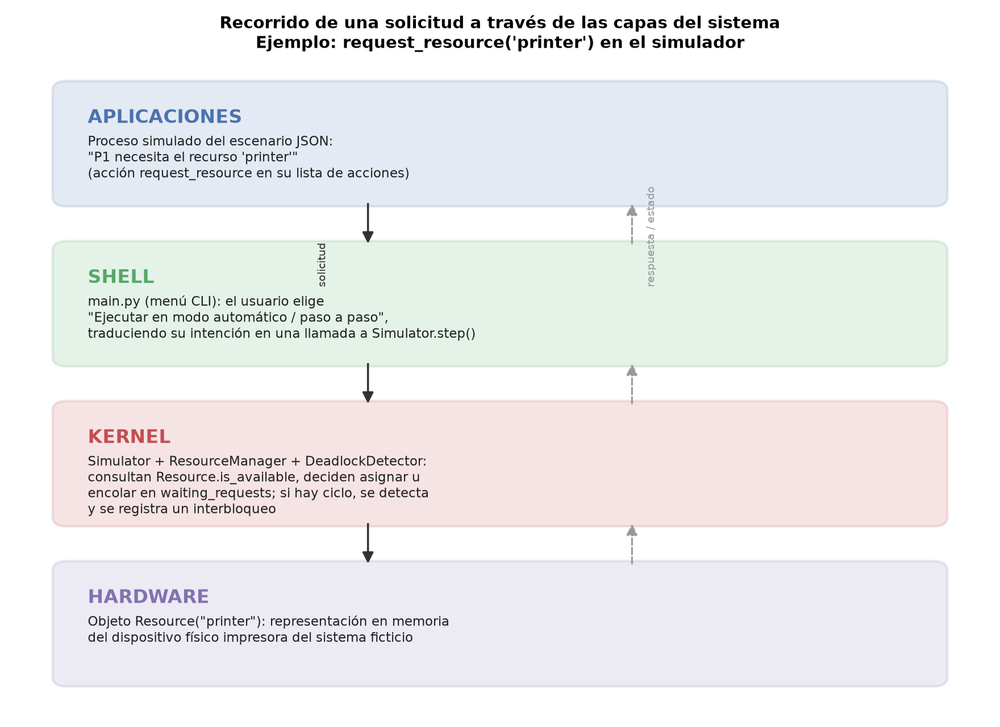
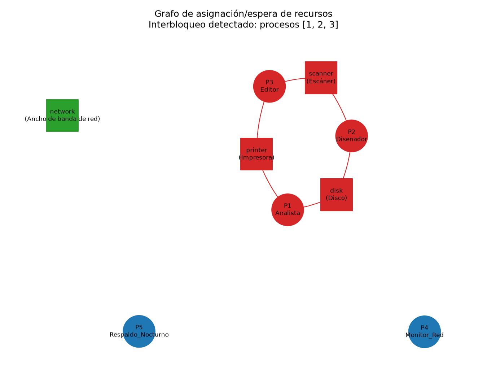

# Simulador de Administración de Recursos e Interbloqueos

## Reporte técnico — Sistemas Operativos

> **Cómo usar este documento:** el contenido técnico está redactado a partir
> del código real del proyecto y de ejecuciones reales de los cinco
> escenarios (no son datos inventados). Los bloques marcados como
> `[COMPLETAR POR EL EQUIPO]` son partes que, por instrucción del proyecto o
> por naturaleza, deben ser aportadas por ustedes (nombres, capturas de
> pantalla tomadas por ustedes, su propia versión del diagrama de capas,
> reflexiones personales). Cuando pasen este documento a Word, respeten esa
> distinción: lean y personalicen también las secciones ya redactadas —
> deben poder explicarlas en la defensa.

---

## Portada

**Proyecto:** Simulador de Administración de Recursos e Interbloqueos
**Materia:** Sistemas Operativos
**Modalidad:** Trabajo en equipo

`[COMPLETAR POR EL EQUIPO: nombres completos de los integrantes, fecha de entrega, nombre de la docente, grupo/sección]`

---

## 1. Introducción

Todo sistema operativo debe repartir un conjunto limitado de recursos
—memoria, dispositivos, archivos— entre varios procesos que compiten por
ellos. Cuando esa repartición se hace mal, aparecen dos fenómenos que este
proyecto busca ilustrar de forma práctica: la **espera**, que es normal y se
resuelve sola, y el **interbloqueo (deadlock)**, una espera circular que
nunca se resuelve por sí misma y que el sistema operativo debe poder
detectar y romper.

Este documento describe el simulador que desarrollamos en Python para
representar esa administración de recursos: cómo se modelan los procesos,
la memoria, los archivos y los dispositivos; cómo se detectan
automáticamente los interbloqueos; qué estrategia diseñamos para
resolverlos; y qué resultados obtuvimos al ejecutar los cinco escenarios de
prueba exigidos por el proyecto.

`[COMPLETAR POR EL EQUIPO: un párrafo breve sobre el contexto del curso y por qué el equipo eligió los énfasis que eligió, si aplica]`

---

## 2. Objetivo

Desarrollar un simulador en Python que represente la administración de
procesos, memoria, archivos y recursos exclusivos/compartidos que realiza un
sistema operativo, capaz de:

- Identificar situaciones de espera normal, bloqueo e interbloqueo.
- Analizar automáticamente, a partir del estado real de la simulación, si
  están presentes las cuatro condiciones necesarias para un interbloqueo
  (exclusión mutua, espera y retención, no expropiación, espera circular).
- Aplicar una estrategia propia para romper el interbloqueo y permitir que
  la simulación continúe.
- Integrar los conceptos de organización de la computadora, capas
  Hardware-Kernel-Shell-Aplicaciones, llamadas al sistema, y monitoreo real
  con `psutil`, dentro de una interfaz utilizable (CLI).

---

## 3. Descripción general del proyecto

El simulador representa un sistema ficticio en el que varios **procesos**
solicitan **memoria**, **recursos** (exclusivos o compartidos) y realizan
**operaciones sobre archivos** para completar una secuencia de acciones
definida en un **escenario externo** (archivo `.json`). El escenario define,
sin tocar el código fuente: la memoria total disponible, los recursos del
sistema (nombre, tipo, cantidad), los archivos iniciales, y la lista
ordenada de acciones que cada proceso ejecuta (pedir memoria, pedir un
recurso, leer/escribir un archivo, liberar, terminar, etc.).

El motor de simulación (`Simulator`) avanza esa lista de acciones un paso a
la vez. Cuando una solicitud no puede satisfacerse de inmediato, el proceso
pasa a estado de **espera**; si esa espera resulta ser parte de un ciclo sin
salida, el sistema la reconoce como **interbloqueo**, lo registra con el
análisis de las cuatro condiciones, permite visualizarlo como grafo, y
finalmente aplica una **estrategia de recuperación** para que la simulación
pueda continuar.

Todo el proceso queda registrado en un archivo de log independiente por
cada ejecución, y el programa incluye una sección de monitoreo con
`psutil` que muestra el estado **real** de la máquina (CPU, RAM, disco,
red), claramente separada de los recursos **simulados** del proyecto.

---

## 4. Arquitectura del sistema desarrollado

El proyecto está organizado en módulos con responsabilidades separadas:

```
main.py                          Interfaz CLI (menú interactivo)
src/
├── models/                      Entidades de datos puras
│   ├── process.py               Process, ProcessState (READY/WAITING/BLOCKED/TERMINATED)
│   ├── resource.py              Resource (exclusivo o compartido, con cantidad)
│   ├── memory.py                Memory (total, usada, máxima usada)
│   ├── file.py                  SimulatedFile (creado, en uso, propietario)
│   └── event.py                 Event (una línea del log)
├── managers/                    Lógica de administración de cada recurso
│   ├── process_manager.py       Alta, consulta y cambio de estado de procesos
│   ├── memory_manager.py        Asignación y liberación de memoria
│   ├── resource_manager.py      Asignación, espera y liberación de recursos
│   └── file_manager.py          Crear/leer/escribir/mover/eliminar archivos
├── simulation/
│   ├── scenario_loader.py       Carga y valida los escenarios .json
│   └── simulator.py             Motor que orquesta todo lo anterior
├── deadlock/
│   ├── deadlock_detector.py     Grafo de asignación/espera + detección de ciclos
│   └── recovery.py              Estrategia de recuperación (terminación forzada)
├── visualization/
│   └── graph_visualizer.py      Dibuja el grafo con NetworkX + Matplotlib
├── monitoring/
│   └── system_monitor.py        Monitoreo real de la máquina con psutil
└── logging_system/
    └── event_logger.py          Escribe cada evento a un archivo de log
```

Esta separación permite que cada responsabilidad se pueda entender, probar
y explicar de forma independiente: `ProcessManager` no sabe nada de
memoria; `MemoryManager` no sabe nada de recursos exclusivos; el
`DeadlockDetector` no modifica el estado, solo lo analiza; y `Simulator` es
el único componente que coordina a todos los demás.

`[COMPLETAR POR EL EQUIPO: si quieren, agreguen aquí un diagrama de cajas de esta misma estructura hecho por ustedes, con su propio estilo]`

---

## 5. Descripción de los procesos simulados

Cada proceso (`src/models/process.py`) se representa con:

- **Identificador único** (`pid`) y **nombre**.
- **Memoria requerida** (`memory_required`).
- **Recursos que necesita** (`required_resources`) y **recursos que
  posee actualmente** (`held_resources`).
- **Estado actual** (`ProcessState`): `READY` (activo/listo), `WAITING`
  (esperando un recurso o memoria que se espera se libere pronto),
  `BLOCKED` (forma parte de un interbloqueo confirmado) o `TERMINATED`
  (terminó normalmente o fue finalizado por la estrategia de recuperación).
- **Acciones pendientes** (`pending_actions`): la cola de acciones que aún
  le faltan por ejecutar, tomada directamente del escenario.

El motor de simulación no "sabe" de antemano si un escenario va a producir
un interbloqueo: en cada paso simplemente intenta ejecutar la primera
acción pendiente de cada proceso. Si la acción tiene éxito (por ejemplo, la
memoria alcanza o el recurso está libre), el proceso pasa a `READY` y la
acción se retira de su cola. Si falla porque el recurso está ocupado o no
hay memoria suficiente, el proceso pasa a `WAITING` y **vuelve a intentar
la misma acción automáticamente en los siguientes pasos**, sin intervención
manual. Solo cuando el sistema detecta que ese `WAITING` forma parte de un
ciclo sin salida, el o los procesos involucrados pasan a `BLOCKED`.

---

## 6. Administración de memoria

`Memory` y `MemoryManager` (`src/models/memory.py`,
`src/managers/memory_manager.py`) implementan:

- **Memoria total configurable desde el escenario**, mediante el campo
  `system.memory_total` del JSON — nunca está fija en el código.
- **Decisión de suficiencia**: `MemoryManager.request_memory(pid, amount)`
  comprueba si `amount <= disponible` antes de conceder.
- **Liberación al terminar**: `Simulator._terminate_process` llama a
  `memory_manager.release_all(pid)` para todo proceso que termina, ya sea
  de forma normal o por la estrategia de recuperación.
- **Qué sucede si no alcanza**: el proceso pasa a `WAITING` y se registra
  un evento `MEMORY_WAIT`; el sistema reintenta automáticamente en cada
  paso posterior (`_reevaluate_waiting_processes`) hasta que se libera
  memoria suficiente.
- **Visibilidad en todo momento**: `MemoryManager.status()` expone
  `total`, `used`, `available` y `max_used`; el menú (opción "Ver estado
  actual") los muestra en cualquier momento de la simulación.
- **Uso máximo registrado**: `Memory.allocate()` actualiza `max_used` cada
  vez que una asignación supera el máximo anterior, quedando disponible al
  final como parte de las métricas.

---

## 7. Administración de archivos

`FileManager` (`src/managers/file_manager.py`) implementa las cinco
operaciones exigidas: **crear, leer, escribir, mover/renombrar y eliminar**
un archivo simulado. Cada `SimulatedFile` tiene un indicador `in_use` y un
`owner`, que se activan durante la operación y se liberan al finalizar.

Para demostrar el ciclo de vida completo, el **Escenario 1** hace que el
proceso `Editor` cree un archivo nuevo (`file_c`), lo escriba, lo
renombre y finalmente lo elimine, además de las operaciones de
lectura/escritura sobre archivos ya existentes que usan los demás
escenarios. El log de esa ejecución muestra la secuencia real:

```
FILE_CREATED: PID 1 creó el archivo 'file_c'.
FILE_WRITE:   PID 1 escribió el archivo 'file_c'.
FILE_MOVED:   PID 1 movió/renombró 'file_c' a 'temporal_procesado.tmp'.
FILE_DELETED: PID 1 eliminó 'file_c'.
```

**Operaciones inválidas:** si una operación no puede realizarse (el
archivo no existe, ya existe uno con el mismo identificador, el tamaño
solicitado es negativo, o el archivo está en uso por otro proceso), el
simulador no falla en silencio: registra un evento
`FILE_OPERATION_REJECTED` con la razón exacta y deja que el proceso
continúe con su siguiente acción, en vez de quedar reintentando para
siempre una operación que nunca podrá completarse. Por ejemplo:

```
FILE_OPERATION_REJECTED: PID 1: operación inválida sobre el archivo 'file_a'.
Ya existe un archivo con ese identificador.
```

`[COMPLETAR POR EL EQUIPO: si lo consideran relevante, comenten aquí por qué eligieron el modelo de apertura/cierre atómico por operación en vez de un archivo que permanece "abierto" entre pasos — ver también la sección de Limitaciones]`

---

## 8. Administración de dispositivos y recursos

`Resource` y `ResourceManager` (`src/models/resource.py`,
`src/managers/resource_manager.py`) modelan tanto **recursos exclusivos**
(una sola unidad, como la impresora o el disco) como **recursos
compartidos** con más de una unidad disponible (por ejemplo, el recurso
`network` del Escenario 5, con cupo para 2 procesos simultáneos).

- El sistema registra qué proceso(s) posee(n) cada recurso
  (`process_resources`) y qué procesos están esperando cuáles recursos
  (`waiting_requests`).
- Si un proceso solicita un recurso ocupado, pasa a `WAITING` y se
  registra un evento `RESOURCE_WAIT` indicando quién lo posee actualmente.
- Cuando el recurso se libera, `Simulator._reevaluate_waiting_processes`
  revisa a todos los procesos en espera y los pasa a `READY` en cuanto el
  recurso vuelve a estar disponible.
- Los recursos —su nombre, tipo y cantidad— se definen enteramente en el
  escenario; el código no asume nunca cuántos recursos exclusivos o
  compartidos va a haber.

El Escenario 5 demuestra explícitamente que dos procesos (`Monitor_Red` y
`Respaldo_Nocturno`) pueden usar el recurso compartido `network`
**simultáneamente sin conflicto**, mientras que en el mismo escenario tres
procesos distintos entran en conflicto real por tres recursos exclusivos
(impresora, disco, escáner).

---

## 9. Identificación de llamadas al sistema dentro del proyecto

El proyecto no implementa llamadas al sistema reales, pero varias acciones
del simulador cumplen exactamente el mismo papel conceptual: son
solicitudes de un **servicio** que solo el "kernel" simulado (los
*managers* y el `Simulator`) puede resolver, porque requieren acceso a un
recurso compartido que el proceso no controla directamente.

| # | Acción del simulador | Código que la resuelve | Por qué es análoga a una llamada al sistema |
|---|---|---|---|
| 1 | `request_memory` | `MemoryManager.request_memory()` | Como `brk`/`mmap`: el proceso no puede tomar memoria por sí mismo, debe pedírsela al "kernel", que decide si hay espacio y actualiza la contabilidad global. |
| 2 | `request_resource` / `release_resource` | `ResourceManager.request_resource()` / `.release_resource()` | Como una primitiva de sincronización de bajo nivel (p. ej. un semáforo o `ioctl` sobre un dispositivo): el kernel arbitra el acceso exclusivo y decide si concede el recurso o pone al proceso a esperar. |
| 3 | `create_file` / `delete_file` | `FileManager.create_file()` / `.delete_file()` | Como `open(..., O_CREAT)` y `unlink()`: crear o destruir una entrada en el sistema de archivos es un servicio que gestiona el kernel, no la aplicación. |
| 4 | `read_file` / `write_file` | `FileManager.read_file()` / `.write_file()` | Como `read()`/`write()`: acceder a datos de un archivo pasa siempre por una capa que controla concurrencia (`in_use`) antes de permitir el acceso. |
| 5 | `move_file` | `FileManager.move_file()` | Como `rename()`: modificar el espacio de nombres del sistema de archivos es una operación arbitrada, no directa. |
| 6 | `terminate` | `Simulator._terminate_process()` | Como `exit()`: el proceso no libera sus propios recursos "a mano"; es el sistema quien, al recibir la notificación de término, se encarga de liberar toda la memoria y los recursos que tenía asignados. |

Cada una de estas seis acciones aparece realmente en los logs generados
por el simulador (ver ejemplos de log en `logs/`), por lo que el análisis
está basado en operaciones que el programa efectivamente ejecuta, no en
una lista teórica.

---

## 10. Relación con las capas Hardware, Kernel, Shell y Aplicaciones

En este proyecto, cada capa tiene un equivalente concreto y verificable en
el código:

- **Aplicaciones:** los procesos simulados definidos en el escenario JSON
  (`Editor`, `ProcesoA`, `Analista`, etc.), cuyas "intenciones" son
  simplemente la lista ordenada de acciones que deben ejecutar.
- **Shell:** `main.py`, el menú interactivo por consola. Es la capa que
  traduce lo que el usuario decide ("cargar este escenario", "avanzar un
  paso", "aplicar la estrategia de recuperación") en llamadas concretas
  sobre el objeto `Simulator`. El usuario nunca llama directamente a un
  *manager*: siempre pasa por el menú.
- **Kernel:** el `Simulator` junto con `ProcessManager`, `MemoryManager`,
  `ResourceManager`, `FileManager` y `DeadlockDetector`. Es la única capa
  que puede conceder o negar una solicitud, la única que mantiene las
  estructuras de estado (quién tiene qué, quién espera qué), y la única
  que decide cuándo hay un interbloqueo y qué hacer al respecto.
- **Hardware:** los objetos `Memory`, `Resource` y `SimulatedFile`: la
  representación en memoria de la RAM, los dispositivos (impresora,
  disco, escáner, ancho de banda de red) y el almacenamiento del sistema
  ficticio que el simulador administra.

### Al menos tres operaciones analizadas por capa

**Operación 1 — Solicitud de memoria (`request_memory`)**

| Capa | Rol en esta operación |
|---|---|
| Aplicación | El proceso declara, en su lista de acciones, que necesita cierta cantidad de memoria antes de continuar. |
| Shell | El usuario elige avanzar la simulación (modo automático o "siguiente evento"), lo que invoca `Simulator.step()`. |
| Kernel | `MemoryManager.request_memory()` consulta `Memory.available`, decide conceder o poner en espera, y actualiza `used` y `max_used`. |
| Hardware | El objeto `Memory` con el total configurado en el escenario, representando la RAM del sistema ficticio. |

**Operación 2 — Solicitud de un recurso exclusivo (`request_resource`)**

| Capa | Rol en esta operación |
|---|---|
| Aplicación | El proceso declara que necesita, por ejemplo, la impresora. |
| Shell | El usuario avanza la simulación desde el menú. |
| Kernel | `ResourceManager.request_resource()` revisa `Resource.is_available`; si no lo está, encola la solicitud. Si el estancamiento resultante forma un ciclo, `DeadlockDetector` lo identifica. |
| Hardware | El objeto `Resource("printer")`, representando el dispositivo físico. |

**Operación 3 — Operación sobre un archivo (`write_file`)**

| Capa | Rol en esta operación |
|---|---|
| Aplicación | El proceso declara que necesita escribir en un archivo del escenario. |
| Shell | El usuario avanza la simulación desde el menú. |
| Kernel | `FileManager.write_file()` controla el indicador `in_use`, valida el nuevo tamaño y actualiza el archivo. |
| Hardware | El objeto `SimulatedFile`, representando el almacenamiento donde reside el archivo. |

El diagrama de la siguiente sección ilustra este mismo recorrido para la
Operación 2, con flechas de solicitud (hacia abajo) y de respuesta/estado
(hacia arriba).

---

## 11. Diagrama de las capas aplicado a operaciones del simulador



*Diagrama: recorrido de una solicitud `request_resource('printer')` a
través de las cuatro capas, con los objetos y funciones reales del código
que intervienen en cada una.*

`[COMPLETAR POR EL EQUIPO: el PDF exige un diagrama PROPIO, no solo la definición de las capas. Usen este diagrama como punto de partida verificado contra el código, pero redibújenlo con su propio estilo/herramienta (a mano, en Draw.io, PowerPoint, etc.) y, si quieren, agreguen una segunda operación además de request_resource. El archivo fuente está en docs/diagrama_capas.png; pueden regenerarlo o reemplazarlo]`

---

## 12. Descripción de la detección de interbloqueos

`DeadlockDetector` (`src/deadlock/deadlock_detector.py`) construye, en cada
consulta, el **grafo de asignación/espera** a partir del estado real de
`ProcessManager` y `ResourceManager` — nunca a partir de datos fijos ni de
nombres esperados como "P1" o "R1":

- Cada proceso es un nodo `P:<pid>`; cada recurso es un nodo `R:<id>`.
- Una arista `R -> P` significa "este recurso está asignado a este
  proceso" (se construye desde `resource_manager.process_resources`).
- Una arista `P -> R` significa "este proceso está esperando este
  recurso" (se construye desde `resource_manager.waiting_requests`).
- Un **ciclo** en ese grafo es, por definición, un interbloqueo: cada
  proceso del ciclo espera un recurso que retiene el siguiente proceso del
  ciclo, sin que ninguno pueda avanzar.

La búsqueda de ciclos usa `networkx.simple_cycles()`, un algoritmo general
que no asume ningún tamaño ni forma particular del ciclo. Esto es lo que
permite que el mismo código detecte tanto el interbloqueo simple de 2
procesos del Escenario 3 como el interbloqueo de **3 procesos** del
Escenario 5 (`Analista → disco → Diseñador → escáner → Editor → impresora
→ Analista`), sin ningún cambio en el algoritmo.

La detección puede ejecutarse **automáticamente** (el `Simulator` la
invoca cada vez que ningún proceso logra avanzar en un paso) o **bajo
demanda**, desde la opción "Detectar interbloqueos" del menú, sin alterar
el estado de la simulación.

---

## 13. Análisis de las cuatro condiciones

Cuando `DeadlockDetector` confirma un ciclo, evalúa automáticamente las
cuatro condiciones sobre los procesos y recursos **reales** involucrados en
ese ciclo (no hay ningún texto fijo por caso: la explicación se construye
con los nombres, PIDs y recursos concretos del escenario):

| Condición | Cómo se verifica en el código |
|---|---|
| **Exclusión mutua** | Se confirma si algún recurso del ciclo no tiene unidades disponibles (`Resource.is_available == False`): nadie más puede tomarlo mientras su propietario lo retiene. |
| **Espera y retención** | Se confirma si al menos un proceso del ciclo tiene `held_resources` no vacío mientras solicita otro recurso adicional. |
| **No expropiación** | Es una propiedad estructural del simulador: durante la ejecución normal, ningún recurso se retira a la fuerza de un proceso; solo se libera cuando el proceso termina voluntariamente o cuando se aplica la estrategia de recuperación. |
| **Espera circular** | Se confirma por construcción: el reporte solo se genera cuando `networkx.simple_cycles()` efectivamente encontró un ciclo cerrado en el grafo. |

Ejemplo real, tomado del log del Escenario 3:

```
DEADLOCK_DETECTED: Interbloqueo detectado. Procesos: [1, 2]. Recursos:
['disk', 'printer']. Condiciones presentes: exclusion_mutua,
espera_y_retencion, no_expropiacion, espera_circular.

[espera_circular] Se encontró una cadena cerrada en el grafo de
asignación/espera: printer(Impresora) -> P1(ProcesoA) -> disk(Disco) ->
P2(ProcesoB) -> printer(Impresora)
```

---

## 14. Descripción de la estrategia de prevención o recuperación

Implementamos una estrategia de **recuperación por terminación forzada**
(`src/deadlock/recovery.py`), que rompe deliberadamente la condición de
**no expropiación**.

**Cómo funciona:**

1. Cuando se confirma un interbloqueo, se elige una "víctima" entre los
   procesos del ciclo: el que **retiene menos recursos** en ese momento
   (para minimizar el trabajo perdido). En caso de empate, se elige el
   **PID más alto** (el proceso que ingresó más recientemente al sistema).
   Esta regla se recalcula sobre los procesos reales del ciclo detectado;
   no depende de ningún PID fijo.
2. Al proceso víctima se le retiran **a la fuerza** todos sus recursos y su
   memoria asignada, y se le termina.
3. El sistema registra qué decisión tomó y por qué (`DEADLOCK_RECOVERY` en
   el log), y actualiza el estado de procesos y recursos.
4. Los procesos restantes —incluidos los que no formaban parte del
   ciclo— continúan normalmente. El recurso liberado por la víctima se
   reevalúa de inmediato para los procesos que lo estaban esperando.

**Por qué esta estrategia funciona:** un ciclo de espera circular necesita
que *todos* sus miembros retengan al menos un recurso que otro miembro del
mismo ciclo está esperando. Al eliminar por completo a un proceso del
ciclo, se elimina también al menos una de esas aristas de retención, lo
que hace **estructuralmente imposible** que el ciclo permanezca cerrado:
el siguiente proceso en la cadena recibe el recurso liberado y puede
continuar, y ese efecto se propaga hasta deshacer todo el ciclo. Esto se
verificó explícitamente en el Escenario 5, donde el ciclo de **tres**
procesos se rompe terminando a **uno solo** de ellos (PID 3), y los otros
dos completan su ejecución con normalidad.

`[COMPLETAR POR EL EQUIPO: si quieren discutir alternativas que consideraron y descartaron —p. ej. rollback parcial, jerarquía de recursos para prevención, algoritmo del banquero para evitación— este es el lugar]`

---

## 15. Capturas de los escenarios ejecutados

`[COMPLETAR POR EL EQUIPO: capturas de pantalla reales de su propia ejecución. Se recomienda incluir, como mínimo:]`

1. Menú principal del simulador (`python main.py`).
2. Escenario 1 (normal) corriendo en modo automático hasta el resultado final.
3. Escenario 3 (interbloqueo) en **modo paso a paso**, mostrando el momento exacto en que aparece `DEADLOCK_DETECTED` y los procesos quedan `BLOCKED` (antes de resolver).
4. La opción "Detectar interbloqueos" mostrando el análisis de las cuatro condiciones.
5. La opción "Aplicar estrategia de recuperación" y el estado inmediatamente después.
6. La opción "Monitoreo del sistema (psutil)".

---

## 16. Visualización de procesos y recursos

El módulo `graph_visualizer.py` genera una imagen del grafo de
asignación/espera usando NetworkX y Matplotlib. Los procesos se dibujan
como círculos azules y los recursos como cuadrados (verde si están libres,
naranja si están ocupados); cuando existe un interbloqueo, los nodos y
aristas que forman el ciclo se resaltan en **rojo**, de modo que el ciclo
se reconoce de un vistazo.

Ejemplo real generado por el propio simulador, correspondiente al
interbloqueo de tres procesos del Escenario 5 (`docs/../visualizations/ejemplo_interbloqueo_3_procesos.png`):



Se observa el ciclo cerrado entre `Analista`, `Disenador` y `Editor` a
través de los recursos `disk`, `scanner` y `printer` (en rojo), mientras
que `Monitor_Red` y `Respaldo_Nocturno` (en azul, abajo) y el recurso
compartido `network` (en verde) permanecen fuera del ciclo, sin verse
afectados.

---

## 17. Resultados y métricas

Métricas obtenidas al ejecutar cada uno de los cinco escenarios en modo
automático hasta el final (datos reales, tomados directamente de
`Simulator.get_status()["metrics"]`):

| Escenario | Procesos | Terminados | Solicitudes de recursos | Veces que un proceso esperó | Uso máx. de memoria | Interbloqueos detectados | Interbloqueos resueltos | Recursos en el/los interbloqueo(s) | Procesos abortados |
|---|---|---|---|---|---|---|---|---|---|
| 1 — Normal | 2 | 2 | 2 | 0 | 550 | 0 | 0 | — | — |
| 2 — Espera temporal | 2 | 2 | 4 | 2 | 500 | 0 | 0 | — | — |
| 3 — Interbloqueo | 2 | 2 | 7 | 4 | 400 | 1 | 1 | disk, printer | PID 2 |
| 4 — Prevención/recuperación | 3 | 3 | 11 | 8 | 400 | 1 | 1 | scanner, usb_drive | PID 2 |
| 5 — Amplio | 5 | 5 | 29 | 22 | 1250 | 1 | 1 | disk, printer, scanner | PID 3 |

En los cinco escenarios, el **100% de los procesos terminó** (ya sea
completando su trabajo o siendo finalizado por la estrategia de
recuperación), y ningún proceso quedó `BLOCKED` de forma permanente al
final de la simulación.

---

## 18. Análisis de los escenarios

### Escenario 1 — Ejecución normal sin interbloqueo

- **Objetivo:** demostrar que dos procesos que usan recursos disjuntos
  (cada uno su propio dispositivo exclusivo) completan su trabajo sin
  ninguna espera, y ejercitar las cinco operaciones de archivo
  (crear/leer/escribir/mover/eliminar).
- **Procesos involucrados:** `Editor` (PID 1, 300 unidades de memoria,
  usa `printer`) y `Generador de reportes` (PID 2, 250 unidades, usa
  `disk`).
- **Memoria disponible:** 1000 unidades.
- **Recursos definidos:** `printer` (exclusivo, 1 unidad), `disk`
  (exclusivo, 1 unidad).
- **Solicitudes realizadas:** memoria, un recurso exclusivo cada uno,
  operaciones de archivo (incluyendo el ciclo completo crear → escribir →
  mover → eliminar de `file_c` en PID 1), liberación y terminación.
- **Comportamiento esperado:** ningún proceso debería esperar, porque no
  comparten ningún recurso.
- **Resultado obtenido:** confirmado. `waits = 0`, `deadlocks_detected =
  0`. Los dos procesos terminan correctamente; uso máximo de memoria de
  550 unidades (300 + 250, el punto de mayor ocupación simultánea).

### Escenario 2 — Espera temporal sin interbloqueo

- **Objetivo:** demostrar una espera real (`WAITING`) que se resuelve por
  sí sola, sin llegar a interbloqueo.
- **Procesos involucrados:** `Compilador` (PID 1, 300 unidades, usa
  `printer` primero) e `ImpresionReportes` (PID 2, 200 unidades, también
  necesita `printer`).
- **Memoria disponible:** 800 unidades.
- **Recursos definidos:** `printer` (exclusivo, 1 unidad) — deliberadamente
  el **mismo** recurso para ambos procesos.
- **Solicitudes realizadas:** ambos piden `printer`; P2 solicita antes de
  que P1 lo libere.
- **Comportamiento esperado:** P2 debe quedar en `WAITING` hasta que P1
  libere la impresora; después, P2 debe poder tomarla y terminar con
  normalidad. No debe generarse ningún interbloqueo, porque la espera es
  unidireccional (P2 espera a P1, pero P1 no espera nada de P2).
- **Resultado obtenido:** confirmado. `waits = 2` (dos ciclos en los que
  P2 reintentó sin éxito antes de conseguir la impresora),
  `deadlocks_detected = 0`. Ambos procesos terminan correctamente.

### Escenario 3 — Interbloqueo

- **Objetivo:** provocar un interbloqueo real de dos procesos y dos
  recursos, y verificar que el detector lo identifique automáticamente sin
  ninguna condición especial en el código.
- **Procesos involucrados:** `ProcesoA` (PID 1, 200 unidades, pide
  `printer` y luego `disk`) y `ProcesoB` (PID 2, 200 unidades, pide `disk`
  y luego `printer` — **orden cruzado** respecto a P1).
- **Memoria disponible:** 1000 unidades.
- **Recursos definidos:** `printer` y `disk`, ambos exclusivos.
- **Solicitudes realizadas:** cada proceso obtiene su primer recurso y
  luego queda esperando el que el otro ya tomó.
- **Comportamiento esperado:** espera circular permanente: P1 espera
  `disk` (en poder de P2), P2 espera `printer` (en poder de P1). Ninguno
  puede avanzar por sí mismo.
- **Resultado obtenido:** confirmado. El detector identificó el ciclo
  `printer -> P1 -> disk -> P2 -> printer`, con las cuatro condiciones
  presentes. La estrategia de recuperación terminó a PID 2 (menos recursos
  retenidos), liberando `disk`; PID 1 pudo completar su trabajo con
  normalidad. `deadlocks_detected = 1`, `deadlocks_resolved = 1`.

### Escenario 4 — Prevención y recuperación de interbloqueo

- **Objetivo:** demostrar la estrategia de recuperación con recursos
  distintos a los del Escenario 3, y probar que un proceso **ajeno** al
  ciclo (`Monitor`) no se ve afectado por la recuperación.
- **Procesos involucrados:** `Escaneo` (PID 1, 150 unidades, pide
  `scanner` y luego `usb_drive`), `Respaldo` (PID 2, 150 unidades, pide
  `usb_drive` y luego `scanner`), y `Monitor` (PID 3, 100 unidades, sin
  recursos compartidos con los otros dos).
- **Memoria disponible:** 1000 unidades.
- **Recursos definidos:** `scanner` y `usb_drive`, ambos exclusivos.
- **Solicitudes realizadas:** P1 y P2 en orden cruzado (igual patrón que
  el Escenario 3, pero con recursos e integrantes distintos); P3 solo usa
  memoria y un archivo, sin ningún recurso exclusivo.
- **Comportamiento esperado:** P1 y P2 deben interbloquearse; P3 debe
  completarse sin ningún problema, típicamente incluso antes de que se
  detecte el interbloqueo, demostrando que el resto del sistema no se
  detiene por un interbloqueo localizado.
- **Resultado obtenido:** confirmado. P3 terminó su ejecución completa
  (memoria, archivo, liberación) mientras P1 y P2 seguían esperando. El
  interbloqueo entre P1 y P2 se detectó y resolvió igual que en el
  Escenario 3 (terminación forzada de PID 2). Los tres procesos terminan:
  dos de forma normal y uno por la estrategia de recuperación.

### Escenario 5 — Escenario amplio con interbloqueo de tres vías

- **Objetivo:** probar que la detección y la recuperación generalizan más
  allá del caso trivial de 2 procesos/2 recursos, con un escenario de
  mayor escala que además combina un recurso compartido.
- **Procesos involucrados:** `Analista` (PID 1), `Disenador` (PID 2),
  `Editor` (PID 3) — forman el ciclo de tres vías — más `Monitor_Red`
  (PID 4) y `Respaldo_Nocturno` (PID 5), que usan el recurso compartido
  `network` sin conflicto entre ellos.
- **Memoria disponible:** 2000 unidades.
- **Recursos definidos:** `printer`, `disk`, `scanner` (exclusivos, 1
  unidad cada uno) y `network` (compartido, cupo para 2).
- **Solicitudes realizadas:** P1 pide `printer` → `disk`; P2 pide `disk`
  → `scanner`; P3 pide `scanner` → `printer` (cada uno cierra el ciclo del
  siguiente); P4 y P5 piden `network` simultáneamente.
- **Comportamiento esperado:** ciclo de tres procesos (no solo dos);
  P4 y P5 deben poder usar `network` al mismo tiempo sin ningún tipo de
  espera, porque su cupo (2) alcanza para ambos.
- **Resultado obtenido:** confirmado. El detector identificó
  correctamente el ciclo de **tres** procesos (`Analista → disk →
  Disenador → scanner → Editor → printer → Analista`), algo que un
  detector escrito solo para el caso de dos procesos no habría logrado. La
  recuperación terminó a PID 3 (Editor), y tanto PID 1 como PID 2
  completaron su trabajo con normalidad. PID 4 y PID 5 terminaron sin
  ninguna espera por `network`, confirmando que un recurso con cupo
  suficiente no genera contención. Es, con diferencia, el escenario con
  mayor uso máximo de memoria (1250) y mayor número de solicitudes (29),
  reflejando su mayor escala.

---

## 19. Limitaciones del simulador

- **Contención de archivos simplificada:** cada operación de archivo
  (`create/read/write/move/delete`) se modela como una operación atómica
  que abre y cierra el archivo dentro de la misma acción. Esto significa
  que, a diferencia de los recursos exclusivos, un archivo nunca queda
  "reservado" entre pasos de la simulación, por lo que dos procesos nunca
  compiten realmente por el mismo archivo en este modelo (aunque el
  código sí valida su existencia y detecta operaciones inválidas).
- **La detección de interbloqueos no cubre la memoria:** un proceso que
  queda esperando memoria indefinidamente (porque nadie más va a liberar
  suficiente) no se clasifica como "interbloqueo" por el detector, que
  solo analiza el grafo de recursos exclusivos/compartidos. Esta es una
  simplificación deliberada, consistente con que el módulo de
  interbloqueos del curso se centra en las cuatro condiciones sobre
  recursos, no sobre memoria.
- **Selección de víctima simple:** el criterio de recuperación (menor
  cantidad de recursos retenidos, con desempate por PID más alto) es
  fácil de justificar y de verificar, pero no considera otros factores que
  un sistema real podría usar, como la prioridad del proceso, cuánto
  trabajo lleva hecho, o el costo de reiniciarlo.
- **Detección y no evitación:** el proyecto implementa *detección +
  recuperación* (se deja que el interbloqueo ocurra y luego se resuelve),
  no *evitación* en el sentido del algoritmo del banquero (que impediría
  conceder una solicitud si pudiera llevar a un estado inseguro). Fue una
  decisión de alcance para mantener el proyecto enfocado en las cuatro
  condiciones vistas en clase.
- **Límite de pasos:** el modo automático se detiene a los 1000 pasos
  como salvaguarda ante escenarios mal diseñados que ni progresan ni
  producen un interbloqueo detectable; es un límite arbitrario, no una
  propiedad del modelo.

`[COMPLETAR POR EL EQUIPO: agreguen cualquier otra limitación que identifiquen al preparar la defensa, especialmente si la docente las señala con el escenario sorpresa]`

---

## 20. Conclusiones

`[COMPLETAR POR EL EQUIPO — se recomienda que cada integrante escriba 2-3 líneas de reflexión personal, además de una conclusión conjunta. Algunos puntos que el equipo podría retomar:]`

- Qué tan bien el modelo de grafo de asignación/espera generaliza la
  detección de interbloqueos (se comprobó con ciclos de 2 y de 3
  procesos sin cambiar el algoritmo).
- Por qué la separación en módulos (managers, deadlock, visualization,
  monitoring) facilitó probar cada parte por separado.
- Qué aprendieron sobre la diferencia entre espera normal e interbloqueo
  al tener que programar la distinción en vez de solo leerla en la teoría.

---

## 21. Referencias consultadas

- Silberschatz, A., Galvin, P. B., & Gagne, G. *Operating System
  Concepts*. Wiley. (Capítulos de administración de procesos, memoria y
  interbloqueos).
- Documentación oficial de Python: <https://docs.python.org/3/>
- Documentación de NetworkX (grafos y `simple_cycles`):
  <https://networkx.org/documentation/stable/>
- Documentación de Matplotlib: <https://matplotlib.org/stable/>
- Documentación de psutil: <https://psutil.readthedocs.io/>

`[COMPLETAR POR EL EQUIPO: agreguen cualquier otra fuente que hayan consultado (apuntes de clase, videos, foros)]`
